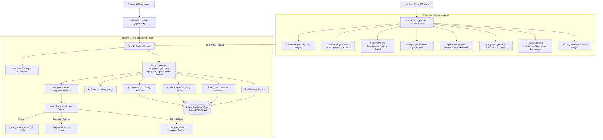

# AI Merchant Growth & Agentic Commerce Platform

<div align="center">


-brightgreen?style=for-the-badge&logo=pytest&logoColor=white)


<p align="center">
  <b>An Enterprise-Grade, Autonomous AI Commerce & Growth Optimization Platform.</b><br>
  Combines deterministic transactional commerce, LangGraph-driven merchant revenue intelligence, resilient multi-LLM failover (Gemini ↔ Groq), machine-readable AI commerce interfaces, simulated external AI buyer agents, and strict Human-In-The-Loop (HITL) safety governance.
</p>

</div>

---

## 📑 Table of Contents

- [1. Executive Summary](#1-executive-summary)
- [2. Platform Architecture](#2-platform-architecture)
  - [High-Level System Flow](#high-level-system-flow)
  - [Agentic Decision & Commerce Boundary](#agentic-decision--commerce-boundary)
- [3. Evolution & Core Capabilities](#3-evolution--core-capabilities)
  - [Phase 1: Commerce Foundation & Transactional Integrity](#phase-1-commerce-foundation--transactional-integrity)
  - [Phase 2: Agentic Intelligence & Explainable AI](#phase-2-agentic-intelligence--explainable-ai)
  - [Phase 3: Revenue Growth Actions & Governance](#phase-3-revenue-growth-actions--governance)
  - [Phase 4: AI-Readable Catalog & Agentic Commerce Interface](#phase-4-ai-readable-catalog--agentic-commerce-interface)
- [4. Safety Invariants & Governance Rules](#4-safety-invariants--governance-rules)
- [5. Technology Stack](#5-technology-stack)
- [6. Repository Structure](#6-repository-structure)
- [7. Quick Start & Setup Guide](#7-quick-start--setup-guide)
  - [Prerequisites](#prerequisites)
  - [Backend Setup](#1-backend-setup)
  - [Frontend Setup](#2-frontend-setup)
- [8. Dual LLM Failover & Zero-Crash Mock Engine](#8-dual-llm-failover--zero-crash-mock-engine)
- [9. API Reference & Endpoints](#9-api-reference--endpoints)
- [10. Testing & Verification Suite](#10-testing--verification-suite)
- [11. Interactive User Experience](#11-interactive-user-experience)

---

## 1. Executive Summary

The **AI Merchant Growth & Agentic Commerce Platform** empowers merchants to scale gross merchandise value (GMV), increase Average Order Value (AOV), and liquidate slow-moving inventory through autonomous AI agent intelligence—while ensuring **absolute financial safety, machine-readability for external AI buyers, and zero unauthorized mutations**.

### Key Differentiators:
1. **Agent-Readable AI Commerce Interfaces**: External AI agents can discover capabilities, query canonical product specifications, check real-time stock, and prepare orders via machine-readable endpoints (`/api/v1/ai/*`).
2. **Simulated LangGraph AI Buyer Agent**: Autonomous external buyer pipeline featuring natural-language intent parsing, capability discovery, catalog query, candidate ranking, live stock verification, and order preparation.
3. **Fact vs. Hypothesis Separation**: Every growth recommendation clearly separates verifiable database order statistics (**FACT**) from growth hypotheses (**AI INTERPRETATION**).
4. **Server-Side Deterministic Financial Pricing**: The backend strictly calculates bundle discounts, price subtotals, and margins on the server, rejecting untrusted client pricing.
5. **Dual LLM Provider Failover**: Primary LLM (Google Gemini) $\leftrightarrow$ Secondary LLM (Groq Llama 3.3 70B) $\leftrightarrow$ Local Deterministic Fallback Engine.
6. **Human-In-The-Loop (HITL) Guardrails**: AI Agent proposals remain non-executable drafts in a pending queue until verified and approved by the merchant.
7. **Idempotency & Pre-Execution Revalidation**: Guarantees zero duplicate campaign or order creation on double-clicks and automatically cancels approvals if real-time inventory depletes before approval.
8. **Immutable Audit Ledger**: Comprehensive chronological event sourcing tracking all actions by `AI_AGENT`, `AI_BUYER`, `MERCHANT`, and `SYSTEM`.

---

## 2. Platform Architecture

### High-Level System Flow



---

## 3. Evolution & Core Capabilities

### Phase 1: Commerce Foundation & Transactional Integrity
* **Relational Schema**: Merchants, Products, Customers, Orders, Order Items, and Audit Logs.
* **Server-Side Pricing**: Unit prices and line totals strictly derived from ground-truth product records in the database.
* **Inventory Management**: Real-time stock quantity checks and atomic inventory decrements upon order confirmation.

### Phase 2: Agentic Intelligence & Explainable AI
* **LangGraph Merchant Growth Agent**: Multi-node workflow performing co-purchase affinity analysis, slow-moving inventory identification, and upsell opportunity generation.
* **Fact vs. AI Separation**: Distinguishes between factual historical statistics and AI recommendations.
* **Dual-Provider Resilience**: Automatic failover between Google Gemini, Groq (Llama 3.3), and local deterministic rules engine.

### Phase 3: Revenue Growth Actions & Governance
* **Structured Action Proposals**: Converts analytical insights into concrete, executable promotional campaigns (Bundles, Cross-sells, Upsells, Slow-moving discounts).
* **Deterministic Safety Validator (`safety_service.py`)**: Validates merchant ownership, maximum discount bounds, maximum campaign duration, and active inventory status.
* **Human-In-The-Loop Approvals (`approvals.py`)**: Enforces explicit merchant review before execution.
* **Pre-Execution Re-Validation**: Re-checks live stock right before activation to prevent stock-out promotions.
* **Idempotent Execution**: Caches approval outcomes to prevent duplicate campaign creation.
* **Failure Simulation & Safe Recovery**: Automated fallback and audit logging on transient execution errors.

### Phase 4: AI-Readable Catalog & Agentic Commerce Interface
* **Machine-Readable Discovery Manifest (`/api/v1/ai/merchant/{id}/manifest`)**:
  - Provides external AI agents with an API capability manifest declaring available capabilities (`catalog: true`, `search: true`, `order_creation: true`, `payment: false`).
* **Canonical `AIProduct` Specification (`/api/v1/ai/catalog`)**:
  - Exposes standardized JSON schemas with brand attributes, purchase constraints (`max_quantity_per_order=5`), and deterministic availability states (`IN_STOCK`, `LOW_STOCK`, `OUT_OF_STOCK`, `INACTIVE`).
* **Deterministic Ranked Product Search (`/api/v1/ai/search`)**:
  - Fact-based scoring engine: Exact product-name match (+50), Category match (+30), In-stock (+20), Within price range (+20), Partial keyword match (+10).
* **AI Order Creation & Idempotency (`/api/v1/ai/orders`)**:
  - Accepts orders from external AI buyers with zero-trust pricing (server calculates all totals).
  - Handles `Idempotency-Key` headers to guarantee duplicate requests return the same order without double stock deduction.
* **Simulated AI Buyer Agent (`/api/v1/buyer/chat`, `/api/v1/buyer/simulate-order`)**:
  - LangGraph workflow simulating an external consumer buyer: Intent Parsing $\rightarrow$ Manifest Discovery $\rightarrow$ Ranked Search $\rightarrow$ Candidate Evaluation $\rightarrow$ Ground-Truth Stock Verification $\rightarrow$ Order Preparation.
  - Strictly isolated through API boundaries (zero direct database ORM access).
* **UI Dashboards**:
  - **AI Readiness Dashboard (`/ai-commerce`)**: Manifest viewer, readiness checklist, and live AI Buyer activity ledger.
  - **Simulated AI Buyer (`/ai-buyer`)**: Interactive conversational shopping agent, ranked candidate cards, checkout preview drawer, and receipt generation.

---

## 4. Safety Invariants & Governance Rules

| Rule | Enforcement Mechanism | Failure Action |
| :--- | :--- | :--- |
| **No Autonomous Money Movement** | Architectural Invariant (Phase 4) | `manifest.capabilities.payment = False`; `payment_status = "NOT_AVAILABLE"`. Autonomous transactions deferred to Phase 5. |
| **No Direct DB Access for External Agents** | Schema & Interface Isolation | AI Buyer communicates exclusively via `/api/v1/ai/*` endpoints with zero SQLAlchemy ORM imports. |
| **Server-Side Pricing Truth** | `order_service.py` & `growth_service.py` | Client-provided totals are discarded. Prices strictly fetched from DB ground truth. |
| **Purchase Constraint Guardrails** | Deterministic Safety Engine | Orders exceeding 5 units per item are rejected with HTTP 400. |
| **Order Idempotency** | `Idempotency-Key` Cache & DB Lookup | Duplicate keys return existing order without creating duplicate records or deducting stock twice. |
| **HITL Campaign Approvals** | Approval Queue & State Machine | Growth campaigns require explicit merchant approval before activation. |
| **Pre-Execution Re-Validation** | `SafetyService.validate_action_proposal` | Stock-out or policy violation automatically cancels approval. |
| **Immutable Audit Logging** | `audit_service.py` | All operations logged with timestamp, actor (`MERCHANT`, `AI_AGENT`, `AI_BUYER`, `SYSTEM`), status, and metadata. |

---

## 5. Technology Stack

### Backend
* **Python 3.12+**
* **FastAPI 0.110+** (Asynchronous REST API framework)
* **SQLAlchemy 2.0+** (Relational ORM)
* **SQLite / WAL Mode** (ACID transactional database)
* **Pydantic v2** (Strict schema validation)
* **LangGraph 0.2+** (StateGraph orchestration for Merchant & Buyer Agents)
* **Google Generative AI SDK** (`gemini-1.5-flash`)
* **Groq SDK** (`llama-3.3-70b-versatile`)
* **PyTest 8.4+** (Automated test suite)

### Frontend
* **React 18** (Modern component UI)
* **TypeScript 5.0+** (Type-safe client development)
* **Vite 5.0+** (Fast bundler & HMR dev server)
* **React Router v6** (Client-side routing)
* **Lucide React** (Clean modern icon set)
* **Vanilla CSS (Design Tokens)** (Glassmorphic dark aesthetic)

---

## 6. Repository Structure

```text
selleragent/
├── backend/
│   ├── app/
│   │   ├── ai_buyer/             # Phase 4: Simulated AI Buyer Agent
│   │   │   ├── __init__.py
│   │   │   ├── agent.py          # LangGraph Buyer StateGraph workflow
│   │   │   ├── schemas.py        # Buyer request/response schemas
│   │   │   ├── state.py          # BuyerState TypedDict
│   │   │   └── tools.py          # Isolated client proxy tools
│   │   ├── commerce/             # Phase 4: AI-Readable Commerce Engine
│   │   │   ├── __init__.py
│   │   │   ├── catalog.py        # Canonical AIProduct catalog query
│   │   │   ├── discovery.py      # Manifest & Profile generator
│   │   │   ├── order_service.py  # Safe order creation & idempotency
│   │   │   ├── policies.py       # Availability & purchase constraints
│   │   │   ├── schemas.py        # AI commerce Pydantic contracts
│   │   │   └── service.py        # Deterministic ranked search
│   │   ├── core/                 # Config & Security
│   │   ├── db/                   # Models, Database session & Seeding
│   │   ├── routers/              # FastAPI REST Routers
│   │   │   ├── commerce.py       # /api/v1/ai/* endpoints
│   │   │   ├── buyer.py          # /api/v1/buyer/* endpoints
│   │   │   ├── growth.py         # /api/v1/growth/* endpoints
│   │   │   ├── approvals.py      # /api/v1/approvals/* endpoints
│   │   │   ├── campaigns.py      # /api/v1/campaigns/* endpoints
│   │   │   ├── audit.py          # /api/v1/audit/* endpoints
│   │   │   ├── agent.py          # /api/v1/agent/* endpoints
│   │   │   ├── products.py       # /api/v1/products/* endpoints
│   │   │   ├── orders.py         # /api/v1/orders/* endpoints
│   │   │   └── merchants.py      # /api/v1/merchants/* endpoints
│   │   ├── services/             # Growth & Safety Services
│   │   └── main.py               # FastAPI entry point
│   ├── tests/                    # 74 Unit & Integration Tests
│   ├── seed.py                   # Demo database population
│   └── verify_phase4_live.py     # End-to-End live test script
├── frontend/
│   ├── src/
│   │   ├── components/           # Layout & Shared components
│   │   ├── pages/                # React views
│   │   │   ├── AiCommercePage.tsx# Phase 4 AI Readiness & Manifest view
│   │   │   ├── AiBuyerPage.tsx   # Phase 4 Simulated AI Buyer Sandbox
│   │   │   ├── AiAssistantPage.tsx
│   │   │   ├── ApprovalsPage.tsx
│   │   │   ├── CampaignsPage.tsx
│   │   │   ├── AuditPage.tsx
│   │   │   ├── DashboardPage.tsx
│   │   │   ├── ProductsPage.tsx
│   │   │   └── OrdersPage.tsx
│   │   ├── services/             # API clients
│   │   ├── types/                # TypeScript interface definitions
│   │   ├── App.tsx               # App routing
│   │   └── main.tsx
│   └── package.json
└── README.md
```

---

## 7. Quick Start & Setup Guide

### Prerequisites
* **Python 3.12+**
* **Node.js 18+ & npm**

### 1. Backend Setup

```bash
cd backend

# Create and activate virtual environment
python -m venv venv
# Windows:
.\venv\Scripts\activate
# macOS/Linux:
source venv/bin/activate

# Install dependencies
pip install -r requirements.txt

# Configure environment variables (optional for live LLM providers)
cp .env.example .env

# Populate database with sample merchant, products, orders, and campaigns
python seed.py

# Start FastAPI server
uvicorn app.main:app --reload --port 8000
```
Backend API will be live at `http://127.0.0.1:8000`. Swagger documentation available at `http://127.0.0.1:8000/docs`.

### 2. Frontend Setup

```bash
cd frontend

# Install dependencies
npm install

# Start Vite development server
npm run dev
```
Frontend interface will be live at `http://localhost:5173`.

---

## 8. Dual LLM Failover & Zero-Crash Mock Engine

The platform implements multi-tier fallback resilience:

1. **Tier 1 (Google Gemini)**: Analyzes co-purchases, slow-moving items, and generates structured proposals using `gemini-1.5-flash`.
2. **Tier 2 (Groq Cloud)**: If Gemini experiences timeouts, rate limits, or errors, the `LLMManager` automatically falls back to Groq `llama-3.3-70b-versatile`.
3. **Tier 3 (Deterministic Rule Engine)**: If both external LLM APIs are offline or API keys are omitted, the local deterministic engine computes frequency matrices and generates verified proposals with zero downtime.

---

## 9. API Reference & Endpoints

### AI Commerce Interfaces (Phase 4)
| Method | Endpoint | Description |
| :--- | :--- | :--- |
| `GET` | `/api/v1/ai/merchant/{id}/manifest` | Retrieve machine-readable agent capability manifest |
| `GET` | `/api/v1/ai/merchant/{id}/profile` | Retrieve structured store profile & catalog categories |
| `GET` | `/api/v1/ai/catalog` | Fetch canonical `AIProduct` catalog with filters |
| `GET` | `/api/v1/ai/products/{id}` | Inspect ground-truth product specifications & real-time stock |
| `GET` | `/api/v1/ai/search` | Execute deterministic ranked search with scoring breakdown |
| `POST` | `/api/v1/ai/orders` | Create order via AI interface with server pricing & idempotency |

### Simulated AI Buyer (Phase 4)
| Method | Endpoint | Description |
| :--- | :--- | :--- |
| `POST` | `/api/v1/buyer/chat` | Conversational shopping query executed through LangGraph buyer agent |
| `POST` | `/api/v1/buyer/simulate-order` | Direct simulated checkout with real-time explainability |

### Growth Actions & HITL Approvals (Phase 3)
| Method | Endpoint | Description |
| :--- | :--- | :--- |
| `POST` | `/api/v1/growth/propose-action` | Generate structured, safety-validated action proposal |
| `GET` | `/api/v1/approvals` | List pending, approved, or rejected merchant approvals |
| `POST` | `/api/v1/approvals/{id}/approve` | Re-validate and execute approved promotional campaign |
| `POST` | `/api/v1/approvals/{id}/reject` | Explicitly reject a proposed action |
| `GET` | `/api/v1/campaigns` | List active, scheduled, and completed marketing campaigns |
| `GET` | `/api/v1/audit/logs` | Query immutable chronological audit ledger |

---

## 10. Testing & Verification Suite

### Automated PyTest Suite
Run the full test suite covering all 74 unit and integration test cases:
```bash
cd backend
pytest -v
```

```text
======================== 74 passed in 1.15s (100% pass rate) ========================
```

### Live End-to-End Verification
To verify the live running system end-to-end:
```bash
cd backend
python verify_phase4_live.py
```

---

## 11. Interactive User Experience

- **Executive Overview (`/dashboard`)**: Merchant KPIs, gross revenue metrics, inventory health, and recent orders.
- **AI Growth Agent (`/ai-assistant`)**: Conversational growth strategist generating actionable bundle and discount proposals.
- **AI Readiness & Manifest (`/ai-commerce`)**: Machine-readable manifest explorer, capability matrix, and real-time external AI buyer activity stream.
- **Simulated AI Buyer Sandbox (`/ai-buyer`)**: Interactive external buyer chat with intent-aware product ranking, live inventory verification, and order simulation.
- **Approvals & Governance (`/approvals`)**: HITL financial review queue displaying safety checks, discount bounds, and one-click execution.
- **Campaigns (`/campaigns`)**: Live promotions dashboard tracking bundle discounts and cross-sell rules.
- **Audit Trail (`/audit`)**: Chronological audit ledger recording actions by `MERCHANT`, `AI_AGENT`, `AI_BUYER`, and `SYSTEM`.

---

<div align="center">
  <b>AI Merchant Growth & Agentic Commerce Platform</b> • Built for Hackathon Excellence
</div>
