# AI Merchant Growth & Agentic Commerce Platform

<div align="center">


-brightgreen?style=for-the-badge&logo=pytest&logoColor=white)


<p align="center">
  <b>An Enterprise-Grade, Autonomous AI Commerce & Growth Optimization Platform.</b><br>
  Combines deterministic transactional commerce, LangGraph-driven merchant revenue intelligence, resilient multi-LLM failover (Gemini ↔ Groq), machine-readable AI commerce interfaces, simulated external AI buyer agents, Razorpay Test-Mode payments, and strict Human-In-The-Loop (HITL) safety governance.
</p>

</div>

---

## 📑 Table of Contents

- [1. Executive Summary](#1-executive-summary)
- [2. Platform Architecture](#2-platform-architecture)
  - [High-Level System Flow](#high-level-system-flow)
  - [Agentic Decision & Commerce Boundary](#agentic-decision--commerce-boundary)
- [3. Evolution & Core Capabilities](#3-evolution--core-capabilities)
  - [Phase 1: Commerce Foundation & Transactional Integrity](#phase-1-commerce-foundation--transactional-integrity)
  - [Phase 2: Agentic Intelligence & Explainable AI](#phase-2-agentic-intelligence--explainable-ai)
  - [Phase 3: Revenue Growth Actions & Governance](#phase-3-revenue-growth-actions--governance)
  - [Phase 4: AI-Readable Catalog & Agentic Commerce Interface](#phase-4-ai-readable-catalog--agentic-commerce-interface)
  - [Phase 5: Razorpay Test-Mode Payments & Bounded Money Actions](#phase-5-razorpay-test-mode-payments--bounded-money-actions)
- [4. Safety Invariants & Governance Rules](#4-safety-invariants--governance-rules)
- [5. Technology Stack](#5-technology-stack)
- [6. Repository Structure](#6-repository-structure)
- [7. Quick Start & Setup Guide](#7-quick-start--setup-guide)
  - [Prerequisites](#prerequisites)
  - [Backend Setup](#1-backend-setup)
  - [Frontend Setup](#2-frontend-setup)
- [8. Dual LLM Failover & Zero-Crash Mock Engine](#8-dual-llm-failover--zero-crash-mock-engine)
- [9. API Reference & Endpoints](#9-api-reference--endpoints)
- [10. Testing & Verification Suite](#10-testing--verification-suite)
- [11. Interactive User Experience](#11-interactive-user-experience)

---

## 1. Executive Summary

The **AI Merchant Growth & Agentic Commerce Platform** empowers merchants to scale gross merchandise value (GMV), increase Average Order Value (AOV), and liquidate slow-moving inventory through autonomous AI agent intelligence—while ensuring **absolute financial safety, machine-readability for external AI buyers, and zero unauthorized money movement**.

### Key Differentiators:
1. **Explainable, Bounded & Gated Money Actions (Phase 5)**: Every payment proposal contains a transparent reason, deterministic risk tier (`LOW`, `MEDIUM`, `HIGH`, `BLOCKED`), remaining daily limits, and requires explicit human authorization (`[APPROVE & PAY]`) before any checkout executes.
2. **Razorpay Test-Mode Isolated Integration**: Complete checkout lifecycle in test mode with server-side paise conversion (e.g. ₹2,499 $\rightarrow$ 249,900 paise), cryptographic HMAC-SHA256 signature verification, and zero exposure of secrets to the LLM or frontend.
3. **Agent-Readable AI Commerce Interfaces (Phase 4)**: External AI agents can discover capabilities, query canonical product specifications, check real-time stock, and prepare orders via machine-readable endpoints (`/api/v1/ai/*`).
4. **Simulated LangGraph AI Buyer Agent**: Autonomous external buyer pipeline featuring natural-language intent parsing, capability discovery, catalog query, candidate ranking, live stock verification, order creation, and payment proposal.
5. **Fact vs. Hypothesis Separation**: Every growth recommendation clearly separates verifiable database order statistics (**FACT**) from growth hypotheses (**AI INTERPRETATION**).
6. **Server-Side Deterministic Financial Pricing**: The backend strictly calculates bundle discounts, price subtotals, and margins on the server, rejecting untrusted client pricing.
7. **Dual LLM Provider Failover**: Primary LLM (Google Gemini) $\leftrightarrow$ Secondary LLM (Groq Llama 3.3 70B) $\leftrightarrow$ Local Deterministic Fallback Engine.
8. **Idempotency & Pre-Execution Revalidation**: Guarantees zero duplicate charges or double deductions on double-clicks and automatically cancels approvals if real-time inventory or daily spend limits deplete before approval.
9. **Immutable Audit Ledger**: Comprehensive chronological event sourcing tracking all actions by `AI_AGENT`, `AI_BUYER`, `MERCHANT`, and `SYSTEM`.

---

## 2. Platform Architecture

### High-Level System Flow

```mermaid
flowchart TD
    Merchant["Merchant Owner / Operator"] --> WebUI["React 18 + TypeScript Glassmorphic UI"]
    ExternalAIBuyer["External AI Buyer / Agent"] --> AIApiLayer["AI Commerce API (/api/v1/ai/*)"]
    
    subgraph FrontendApp ["Frontend Layer - Vite / React"]
        WebUI --> DashboardPage["/dashboard (KPI Metrics & Insights)"]
        WebUI --> AIAssistantPage["/ai-assistant (Merchant Growth Agent & Proposals)"]
        WebUI --> AICommercePage["/ai-commerce (AI Readiness & Manifest Viewer)"]
        WebUI --> AIBuyerPage["/ai-buyer (Simulated AI Buyer Sandbox)"]
        WebUI --> PaymentApprovalPage["/payment-approval/:id (Explainable Approval Gate)"]
        WebUI --> TransactionsPage["/transactions (Financial Ledger & Decision Chains)"]
        WebUI --> ApprovalsPage["/approvals (Growth Action Review Queue)"]
        WebUI --> CampaignsPage["/campaigns (Active & Scheduled Campaigns)"]
        WebUI --> CatalogPages["/products, /orders, /customers (Commerce Operations)"]
    end

    subgraph BackendApp ["Backend Layer - FastAPI"]
        AIApiLayer --> RouterCommerce["/api/v1/ai/catalog, search, orders"]
        AIApiLayer --> RouterAIPayments["/api/v1/ai/payments/propose, approve, reject"]
        WebUI --> RouterPayments["/api/v1/payments/verify, simulate-failure, list"]
        
        RouterCommerce --> CommerceEngine["Deterministic Commerce & Search Engine"]
        RouterAIPayments --> PaymentService["Payment & Safety Orchestration Engine"]
        RouterPayments --> RazorpayAdapter["Isolated Razorpay Test-Mode Adapter"]
        
        PaymentService --> PolicyEngine["Deterministic Safety & Limits Engine"]
        PaymentService --> AuditService["Immutable Audit & Governance Ledger"]
    end

    subgraph ExternalServices ["Third-Party Services (Test Mode Only)"]
        RazorpayAdapter --> RazorpayAPI["Razorpay Test-Mode API & HMAC-SHA256 Verifier"]
    end

    subgraph DatabaseLayer ["Persistence Layer - SQLite / ACID Relational Schema"]
        CommerceEngine --> RelationalDB[("ACID Relational Database")]
        PaymentService --> RelationalDB
        AuditService --> RelationalDB
    end
```



---

## 3. Evolution & Core Capabilities

### Phase 1: Commerce Foundation & Transactional Integrity
- High-performance FastAPI server with clean schema boundaries.
- Relational SQLite schema with SQLAlchemy 2.0 ORM models for `merchants`, `products`, `customers`, `orders`, and `order_items`.
- Comprehensive CRUD APIs, seed data initialization, and transactional consistency.

### Phase 2: Agentic Intelligence & Explainable AI
- Autonomous LangGraph Merchant AI Agent state machine.
- Analyzes catalog inventory, co-purchasing affinities, and sales trends.
- Multi-LLM provider failover: Google Gemini 1.5 Flash $\leftrightarrow$ Groq Llama 3.3 70B $\leftrightarrow$ Local Fallback Engine.
- Strict read-only tools ensuring zero data mutation during analysis.

### Phase 3: Revenue Growth Actions & Governance
- Structured action proposal generation for Upselling, Cross-Selling, Product Bundling, and Slow-Moving Inventory campaigns.
- Deterministic Safety Policy Engine (`safety_service.py`) enforcing maximum discount limits, duration caps, and stock requirements.
- Human-In-The-Loop (HITL) approval queue with atomic execution and pre-execution inventory revalidation.
- Immutable audit trail logging actor types (`AI_AGENT`, `MERCHANT`, `SYSTEM`).

### Phase 4: AI-Readable Catalog & Agentic Commerce Interface
- Canonical machine-readable specifications: `AIProduct`, `ProductAvailability` (`IN_STOCK`, `LOW_STOCK`, `OUT_OF_STOCK`, `INACTIVE`), `AIMerchantManifest` (v1.0), and `AIMerchantProfile`.
- Deterministic multi-factor ranked search algorithm (`search_ai_products` with +50 exact name, +30 category, +20 stock, +20 price, +10 token matches).
- Server-side order creation with strict stock deduction and `Idempotency-Key` deduplication.
- Simulated LangGraph AI Buyer Agent executing discovery, ranking, stock checks, and ordering.

### Phase 5: Razorpay Test-Mode Payments & Bounded Money Actions
- **Explainable, Bounded & Gated Money Actions**:
  - **Explainable**: Complete justification generated deterministically before payment creation.
  - **Bounded**: Strict single-transaction caps (e.g. ₹5,000) and daily aggregate limits (e.g. ₹25,000) with deterministic risk classification:
    - `LOW`: $\le 25\%$ of single limit
    - `MEDIUM`: $> 25\%$ and $\le 75\%$ of single limit
    - `HIGH`: $> 75\%$ and $\le 100\%$ of single limit
    - `BLOCKED`: $> 100\%$ of single limit or policy disabled
  - **Gated**: Human/Merchant must explicitly authorize via `[APPROVE & PAY]` before checkout creation.
- **Isolated Razorpay Test-Mode Adapter**:
  - Exact deterministic paise conversion ($1\text{ INR} = 100\text{ paise}$).
  - Cryptographic HMAC-SHA256 signature verification on `f"{razorpay_order_id}|{razorpay_payment_id}"`.
  - Secrets (`RAZORPAY_KEY_SECRET`) strictly confined to backend settings and never serialized in API responses or LLM state.
- **Pre-Execution Revalidation & Idempotency**:
  - Re-evaluates ground-truth database order amounts and daily limits at the moment of approval.
  - Replay and duplicate verification requests return existing state without double deductions.
- **Interactive UI & Ledger**:
  - Dedicated `/payment-approval/:id` portal with risk badges and Razorpay test checkout modal.
  - Comprehensive `/transactions` ledger displaying complete explainable decision chains.

---

## 4. Safety Invariants & Governance Rules

| Safety Invariant | Implementation Mechanism | Enforcement Layer |
| :--- | :--- | :--- |
| **Zero Production Money Movement** | Test-Mode keys only (`rzp_test_*`), mock tokens supported, no real bank transfers | `RazorpayAdapter` / Config |
| **Gated Approval Requirement** | AI Buyer cannot self-authorize; must transition through `PENDING_APPROVAL` $\rightarrow$ `APPROVED` via human review | `PaymentService.approve_payment_intent` |
| **Server-Side Price Derivation** | Client order amounts are ignored; prices derived directly from DB product records | `PaymentService.propose_payment` |
| **Deterministic Risk Tiers** | Strict mathematical classification (`LOW`, `MEDIUM`, `HIGH`, `BLOCKED`) in pure Python code | `app/payments/policies.py` |
| **Daily Spend Limit Bounds** | Daily cumulative spend queried from database and evaluated before proposal and approval | `evaluate_payment_policy` |
| **Secret Key Isolation** | `RAZORPAY_KEY_SECRET` never passed to LLM prompts, frontend responses, or audit logs | `config.py` / `schemas.py` |
| **Idempotency & Replay Protection** | Unique `idempotency_key` indices prevent duplicate intent generation or double charges | Relational Schema & Service |
| **Pre-Execution Revalidation** | Verifies order total and daily spend at approval time; aborts if price or stock changed | Approval Gate Handler |

---

## 5. Technology Stack

- **Backend**: Python 3.12+, FastAPI, SQLAlchemy 2.0, Pydantic v2, LangGraph 0.2+, LangChain, HMAC-SHA256 Cryptography
- **Database**: SQLite (ACID-compliant relational schema, foreign keys, cascades)
- **Frontend**: React 18, TypeScript 5, Vite, Lucide Icons, Modern Glassmorphic CSS Design System
- **Testing**: PyTest, Starlette TestClient, Requests Live Verification Suite

---

## 6. Repository Structure

```text
selleragent/
├── backend/
│   ├── app/
│   │   ├── ai_buyer/             # LangGraph Simulated AI Buyer Agent
│   │   │   ├── agent.py          # StateGraph buyer workflow & payment proposal
│   │   │   ├── schemas.py        # Buyer DTOs & intent models
│   │   │   ├── state.py          # BuyerState TypedDict
│   │   │   └── tools.py          # Isolated HTTP/DB client adapter
│   │   ├── commerce/             # Canonical AI Commerce Engine
│   │   │   ├── catalog.py        # Canonical AIProduct serialization
│   │   │   ├── discovery.py      # AIMerchantManifest & Profile generator
│   │   │   ├── orders.py         # Deterministic AI order creation
│   │   │   ├── search.py         # Deterministic multi-factor ranked search
│   │   │   └── schemas.py        # Canonical AI DTOs
│   │   ├── core/                 # Config & Settings (Razorpay, LLM keys)
│   │   ├── db/                   # Database Engine & ORM Models (Payment, PaymentIntent, Order)
│   │   ├── payments/             # Phase 5: Razorpay & Money Actions
│   │   │   ├── exceptions.py     # Custom payment exceptions
│   │   │   ├── payment_service.py# Orchestrator (Propose, Approve, Verify, Simulate)
│   │   │   ├── policies.py       # Deterministic bounds & risk classifier
│   │   │   ├── razorpay_service.py # RazorpayAdapter & HMAC verification
│   │   │   └── schemas.py        # Pydantic schemas for payments & transactions
│   │   ├── routers/              # REST Endpoints (/ai/payments, /payments, /buyer, /commerce)
│   │   └── services/             # Growth, Audit, Safety Services
│   ├── tests/                    # 78 Automated PyTest unit & integration tests
│   ├── verify_phase5_live.py     # Comprehensive 5-scenario live verification script
│   └── requirements.txt
├── frontend/
│   ├── src/
│   │   ├── components/           # Layout, Sidebar, Cards
│   │   ├── pages/
│   │   │   ├── AiBuyerPage.tsx   # Interactive AI Buyer Sandbox
│   │   │   ├── AiCommercePage.tsx# Machine-readable manifest & readiness inspector
│   │   │   ├── PaymentApprovalPage.tsx # Explainable Approval & Razorpay Test Checkout
│   │   │   ├── TransactionsPage.tsx # Financial Ledger & Step-by-Step Decision Chains
│   │   │   ├── ApprovalsPage.tsx # HITL Growth Campaign Review
│   │   │   └── DashboardPage.tsx # Merchant KPI Overview
│   │   ├── services/             # paymentService, buyerService, etc.
│   │   └── types/                # TypeScript Interfaces & Enums
│   └── package.json
└── README.md
```

---

## 7. Quick Start & Setup Guide

### Prerequisites
- Python 3.12+
- Node.js 18+ and npm

### 1. Backend Setup
```bash
cd backend
python -m venv venv
.\venv\Scripts\activate      # Windows (or source venv/bin/activate on Linux/Mac)
pip install -r requirements.txt
uvicorn app.main:app --reload --port 8000
```
Backend API will be live at `http://127.0.0.1:8000` (Docs at `http://127.0.0.1:8000/docs`).

### 2. Frontend Setup
```bash
cd frontend
npm install
npm run dev
```
Frontend UI will be live at `http://localhost:5173`.

---

## 8. API Reference & Endpoints

| Category | Method | Endpoint | Description |
| :--- | :--- | :--- | :--- |
| **System** | `GET` | `/api/v1/health` | Canonical System Health Check & service statuses |
| **Demo Control** | `POST` | `/api/v1/demo/reset` | Pristine demo dataset and inventory restock reset |
| **Agent Commerce** | `POST` | `/api/v1/agent-commerce/sessions` | Create stateful agent session with trace timeline |
| **Agent Commerce** | `GET` | `/api/v1/agent-commerce/sessions/{id}` | Fetch session status & active state |
| **Agent Commerce** | `GET` | `/api/v1/agent-commerce/sessions/{id}/timeline` | Detailed chronological trace event stream |
| **Agent Commerce** | `GET` | `/api/v1/agent-commerce/merchants/{id}` | Standardized Agent Commerce Discovery Contract |
| **Agent Commerce** | `POST` | `/api/v1/agent-commerce/message` | Standardized agent-to-agent message dispatcher |
| **Agent Commerce** | `GET` | `/api/v1/agent-commerce/readiness/{id}` | Deterministic AI Commerce Readiness score & checklist |
| **Agent Commerce** | `GET` | `/api/v1/agent-commerce/stats` | Platform-wide agent commerce metrics |
| **AI Payments** | `POST` | `/api/v1/ai/payments/propose` | Propose payment intent with bounded safety checks |
| **AI Payments** | `GET` | `/api/v1/ai/payments/{id}` | Get payment proposal, risk tier & explainability |
| **AI Payments** | `POST` | `/api/v1/ai/payments/{id}/approve` | **[APPROVE & PAY]** Explicit human authorization gate |
| **AI Payments** | `POST` | `/api/v1/ai/payments/{id}/reject` | Explicit merchant rejection of payment proposal |
| **Payments** | `POST` | `/api/v1/payments/verify` | Verify HMAC-SHA256 signature and mark order PAID |
| **Payments** | `POST` | `/api/v1/payments/simulate-failure` | Graceful test failure recovery without false PAID |
| **Payments** | `POST` | `/api/v1/payments/webhook` | Verified asynchronous webhook listener |
| **Payments** | `GET` | `/api/v1/payments` | List transaction ledger for a merchant |
| **Payments** | `GET` | `/api/v1/payments/{id}/detail` | Full explainable decision chain & audit events |
| **AI Buyer** | `POST` | `/api/v1/buyer/chat` | Conversational external AI Buyer simulation |
| **AI Buyer** | `POST` | `/api/v1/buyer/simulate-order` | Direct AI Buyer checkout with payment intent |
| **AI Commerce**| `GET` | `/api/v1/ai/merchant/{id}/manifest`| Machine-readable capability manifest |
| **AI Commerce**| `GET` | `/api/v1/ai/catalog` | Canonical AI-readable product catalog |
| **AI Commerce**| `POST`| `/api/v1/ai/search` | Deterministic multi-factor ranked search |

---

## 9. Standalone External AI Buyer Client (`demo_external_buyer.py`)

A fully independent, standalone external AI Buyer test client demonstrates end-to-end commerce interactions through public HTTP APIs without importing any backend database models:

```bash
cd backend
.\venv\Scripts\python.exe demo_external_buyer.py
```

### Verified Scenarios:
1. **Autonomous Purchase Lifecycle**: Session $\rightarrow$ Discover $\rightarrow$ Search $\rightarrow$ Stock Check $\rightarrow$ Create Order $\rightarrow$ Payment Proposal $\rightarrow$ Human Approval Gate $\rightarrow$ Razorpay Test Payment $\rightarrow$ Cryptographic Signature Verification $\rightarrow$ Order Confirmed $\rightarrow$ Trace Verified.
2. **Deterministic Policy Limit Rejection**: AI buyer attempts to purchase items exceeding merchant single-transaction cap (₹12,495 > ₹5,000) $\rightarrow$ `PAYMENT_LIMIT_EXCEEDED` $\rightarrow$ 0 Razorpay orders created, 0 money moved.
3. **Out-of-Stock Recovery**: Real-time stock depletion detection safely returns `OUT_OF_STOCK` error envelope.
4. **Simulated Payment Decline**: Graceful failure recovery preserving `PAYMENT_FAILED` state without false `PAID` designations.
5. **Idempotent Duplicate Replay Protection**: Verified payment replayed without double-charging or state corruption.

---

## 10. Testing & Verification Suite

### Automated PyTest Suite (107 Tests - 100% Pass Rate)
Run the full automated test suite:
```bash
cd backend
.\venv\Scripts\pytest.exe -v
```

All 107 tests across all 7 phases pass cleanly:
- `tests/test_phase7_integration.py` (Full end-to-end commerce lifecycle)
- `tests/test_phase7_hardening.py` (Health check, state machines, demo reset, webhook security)
- `tests/test_phase6_sessions.py` (Session creation, state machine, TTL expiration)
- `tests/test_phase6_protocol.py` (Protocol validation, versioning, error envelopes)
- `tests/test_phase6_discovery.py` (Standardized contracts & capability negotiation)
- `tests/test_phase6_commerce_agent.py` (End-to-end message dispatcher)
- `tests/test_phase6_readiness.py` (Deterministic scoring formula 0-100%)
- `tests/test_phase6_security.py` (Isolation, transaction limits & tampering checks)
- `tests/test_phase5_*.py` (Razorpay test-mode payments & approval gates)
- `tests/test_phase4_*.py` (Machine-readable catalog & search)
- `tests/test_phase3_*.py` (Campaigns & HITL approvals)
- `tests/test_phase2_*.py` (LangGraph agent & explainable reasoning)
- `tests/test_phase1_*.py` (Commerce foundation & transactions)

---

## 11. Interactive User Experience & Dedicated Hackathon Screens

- **`/demo` — 3-Minute Judge Demo Screen**: One-click live interactive execution pipeline with side-by-side agent execution timeline, interactive human approval gate, and limit breach triggers.
- **`/agent-commerce` — Agent Commerce Dashboard**: Overview of active AI buyers, autonomous orders, AI GMV revenue, and security invariants.
- **`/agent-commerce/inspector` — Protocol Inspector & Debugger**: Live interactive JSON protocol message dispatcher and response previewer.
- **`/agent-commerce/readiness` — AI Commerce Readiness**: Detailed 8-point weighted capability checklist (0-100%) with recommendations.

---

## 12. License

This project is licensed under the MIT License.

