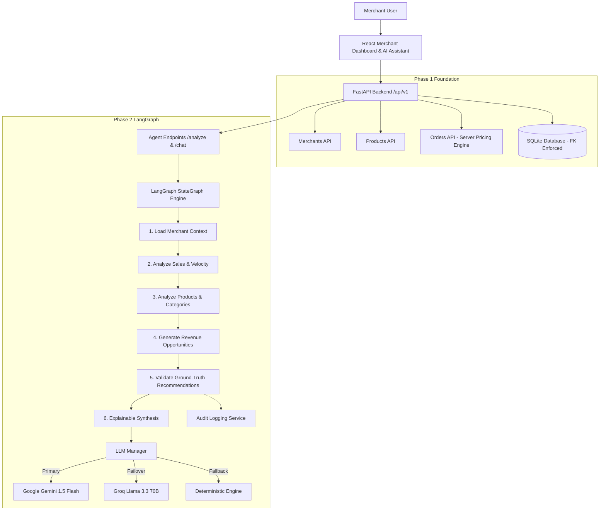

# AI Merchant Growth & Agentic Commerce Platform

> **"Phase 1 established the merchant commerce foundation. Phase 2 introduces the Merchant AI Agent with LangGraph for explainable revenue optimization, upselling, cross-selling, and slow-moving stock identification. Transaction safety workflows and Razorpay payment simulation will be implemented in subsequent phases."**

---

## 1. Project Overview

The **AI Merchant Growth & Agentic Commerce Platform** is an enterprise-grade commerce intelligence solution designed to:
1. Help merchants increase gross revenue through AI-driven upselling, cross-selling, product bundling, and catalog recommendations.
2. Provide ground-truth explainability by strictly separating empirical business **FACTS** (from SQLite/SQL database order history) from **AI GROWTH HYPOTHESES**.
3. Feature resilient **Dual LLM Provider Failover** (Google Gemini $\leftrightarrow$ Groq $\leftrightarrow$ Deterministic Fallback Mode) with zero hardcoded keys.
4. Support bounded financial actions with merchant approval, explainability, and comprehensive audit logs.

---

## 2. System Architecture



---

## 3. Phase 2 Features

### 🧠 Merchant AI Agent with LangGraph
- **LangGraph State Pipeline**: Multi-node state machine executing context ingestion, deterministic sales & co-purchase analysis, opportunity generation, DB ground-truth validation, and explainability synthesis.
- **Dual LLM Failover**: Automatically tries the configured primary LLM (`gemini` or `groq`), fails over to the secondary provider if an API error occurs, and gracefully falls back to deterministic rule-based analysis (`MOCK_AI_MODE=true`) if keys are absent or providers are offline.
- **Explainability Standard**: Every recommendation strictly differentiates between **FACT** (verifiable order statistics) and **AI INTERPRETATION** (growth strategy hypothesis).
- **Opportunity Types**:
  - `CROSS_SELL`: Identifies high affinity co-purchasing pairs (e.g. Running Shoes + Running Socks).
  - `UPSELL`: Surfaces higher-tier alternatives in the same product category (e.g. Running Shoes $\rightarrow$ Premium Running Shoes).
  - `BUNDLE`: Multi-product packaging to increase Average Order Value (AOV).
  - `SLOW_MOVING_PRODUCT`: Detects capital tied up in slow-velocity inventory and suggests bundle liquidation.
- **Interactive AI Assistant UI (`/ai-assistant`)**: Conversational interface with quick suggestion chips, live opportunity cards, and deep review modal.
- **Dashboard KPI Integration (`/dashboard`)**: Displays total active AI opportunities, high-confidence count, and potential revenue impact.
- **Agent Safety Boundary**: Strictly read-only and analytical. The agent has zero capability to execute payments, change prices, mutate inventory, or alter live campaigns without merchant approval.

---

## 4. Technology Stack

### Backend
* **Language**: Python 3.12+
* **Framework**: FastAPI (OpenAPI / Swagger auto-generation)
* **Agent Framework**: LangGraph & LangChain Core
* **LLM Providers**: `langchain-google-genai` (Gemini), `langchain-groq` (Groq)
* **Validation**: Pydantic v2 & Pydantic-Settings
* **ORM**: SQLAlchemy 2.0
* **Database**: SQLite (WAL mode, connection `PRAGMA foreign_keys=ON;`)
* **Testing**: Pytest & HTTPX TestClient (42 automated tests)

### Frontend
* **Framework**: React 18 + TypeScript
* **Tooling**: Vite
* **Routing**: React Router DOM v6
* **Icons**: Lucide React
* **Styling**: Vanilla CSS Design System with dark glassmorphism, responsive tables, and typography tokens

---

## 5. Directory Structure

```text
selleragent/
├── backend/
│   ├── app/
│   │   ├── agent/                      # Phase 2 LangGraph Agent
│   │   │   ├── __init__.py
│   │   │   ├── schemas.py              # Opportunity, AgentAnalysis, AgentChat schemas
│   │   │   ├── state.py                # TypedDict AgentState
│   │   │   ├── tools.py                # Deterministic DB analytics tools
│   │   │   ├── llm.py                  # Gemini <-> Groq failover manager & mock mode
│   │   │   ├── prompts.py              # System prompts & explainability templates
│   │   │   ├── nodes.py                # State graph pipeline nodes
│   │   │   └── graph.py                # Compiled LangGraph runnable workflow
│   │   ├── core/
│   │   │   ├── __init__.py
│   │   │   └── config.py               # Pydantic BaseSettings with LLM config
│   │   ├── db/
│   │   │   ├── database.py             # Engine, SessionLocal, FK pragma
│   │   │   ├── models.py               # Merchant, Product, Customer, Order, OrderItem
│   │   │   └── seed.py                 # Demo seed generator (Chennai Sports Store)
│   │   ├── schemas/                    # Pydantic schemas (Merchants, Products, Orders)
│   │   ├── services/
│   │   │   ├── audit_service.py        # Agent action & tool audit logging
│   │   │   ├── merchant_service.py
│   │   │   ├── product_service.py
│   │   │   ├── customer_service.py
│   │   │   └── order_service.py
│   │   ├── routers/
│   │   │   ├── agent.py                # /api/v1/agent endpoints (/analyze, /chat, /metrics)
│   │   │   ├── merchants.py
│   │   │   ├── products.py
│   │   │   ├── customers.py
│   │   │   └── orders.py
│   │   └── main.py                     # FastAPI app with CORS & lifespan DB init
│   ├── tests/
│   │   ├── test_agent_graph.py         # LangGraph workflow tests
│   │   ├── test_agent_llm.py           # Gemini/Groq/Mock failover tests
│   │   ├── test_agent_safety.py        # Agent read-only safety boundary verification
│   │   ├── test_agent_state.py         # Agent state typing tests
│   │   ├── test_agent_tools.py         # Analytical database tools tests
│   │   ├── test_health.py
│   │   ├── test_merchants.py
│   │   ├── test_products.py
│   │   ├── test_customers.py
│   │   └── test_orders.py
│   ├── seed.py
│   ├── verify_live.py                  # Live smoke & failover verification script
│   ├── requirements.txt
│   ├── .env.example
│   └── README.md
│
├── frontend/
│   ├── src/
│   │   ├── components/
│   │   │   ├── OpportunityCard.tsx     # Opportunity card with FACT vs AI INTERPRETATION
│   │   │   ├── OpportunityDetailsModal.tsx # Opportunity review drawer
│   │   │   ├── StatCard.tsx
│   │   │   ├── Badge.tsx
│   │   │   ├── Modal.tsx
│   │   │   ├── ProductModal.tsx
│   │   │   ├── CustomerModal.tsx
│   │   │   ├── OrderCreateModal.tsx
│   │   │   ├── OrderDetailsModal.tsx
│   │   │   └── Layout.tsx
│   │   ├── pages/
│   │   │   ├── AiAssistantPage.tsx     # /ai-assistant chat & recommendation interface
│   │   │   ├── DashboardPage.tsx       # /dashboard with live AI opportunity KPIs
│   │   │   ├── ProductsPage.tsx        # Catalog management
│   │   │   ├── OrdersPage.tsx          # Order ledger
│   │   │   └── CustomersPage.tsx       # Customer directory
│   │   ├── services/
│   │   │   ├── agentService.ts         # Agent API client
│   │   │   ├── merchantService.ts
│   │   │   ├── productService.ts
│   │   │   ├── customerService.ts
│   │   │   └── orderService.ts
│   │   ├── types/
│   │   │   └── index.ts
│   │   ├── App.tsx
│   │   ├── index.css
│   │   └── main.tsx
│   ├── package.json
│   ├── tsconfig.json
│   ├── vite.config.ts
│   └── README.md
├── .gitignore
├── README.md
└── docker-compose.yml
```

---

## 6. Getting Started

### 1. Backend Setup & Run

```bash
cd backend

# Create and activate virtual environment
python -m venv venv
.\venv\Scripts\Activate.ps1   # Windows PowerShell
# source venv/bin/activate     # Linux / macOS

# Install dependencies
pip install -r requirements.txt

# Configure environment (Optional: add your Gemini/Groq keys)
cp .env.example .env

# Seed database with Chennai Sports Store
python seed.py

# Run complete automated test suite (42 tests)
pytest -v

# Run live smoke verification
python verify_live.py

# Start FastAPI server
uvicorn app.main:app --reload --port 8000
```

### 2. Frontend Setup & Run

```bash
cd frontend
npm install
npm run build
npm run dev
```

* **Merchant Dashboard**: [http://localhost:5173/dashboard](http://localhost:5173/dashboard)
* **AI Merchant Assistant**: [http://localhost:5173/ai-assistant](http://localhost:5173/ai-assistant)
* **Interactive OpenAPI Swagger Docs**: [http://127.0.0.1:8000/docs](http://127.0.0.1:8000/docs)
* **Backend Health Check**: [http://127.0.0.1:8000/api/v1/health](http://127.0.0.1:8000/api/v1/health)

---

## 7. LLM Provider Configuration & Failover

In `backend/.env`:
```ini
PRIMARY_LLM_PROVIDER=gemini # or "groq"
GEMINI_API_KEY=your_gemini_api_key_here
GEMINI_MODEL=gemini-1.5-flash
GROQ_API_KEY=your_groq_api_key_here
GROQ_MODEL=llama-3.3-70b-versatile
MOCK_AI_MODE=false
```

* If `GEMINI_API_KEY` is provided and valid, Gemini generates conversational insights.
* If a Gemini call encounters rate limits or errors, it **automatically fails over to Groq**.
* If `PRIMARY_LLM_PROVIDER=groq` and Groq fails, it **automatically fails over to Gemini**.
* If no API keys are provided or all providers are unavailable, it **seamlessly engages the Deterministic Fallback Engine**, computing factual insights from the SQLite database with zero application crashes.
