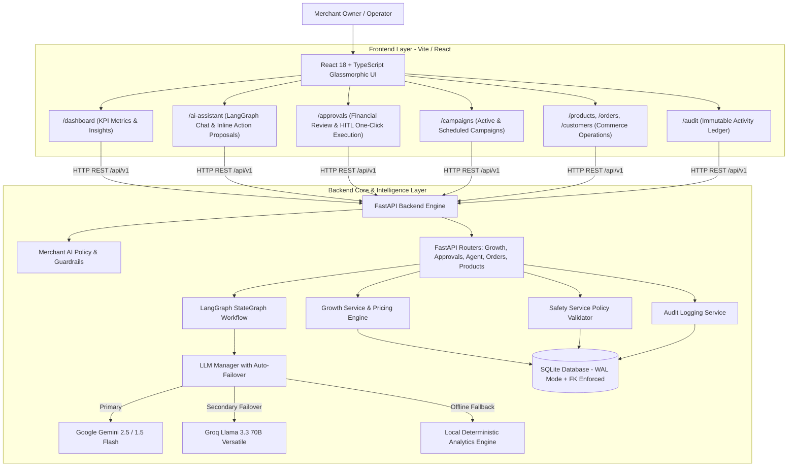
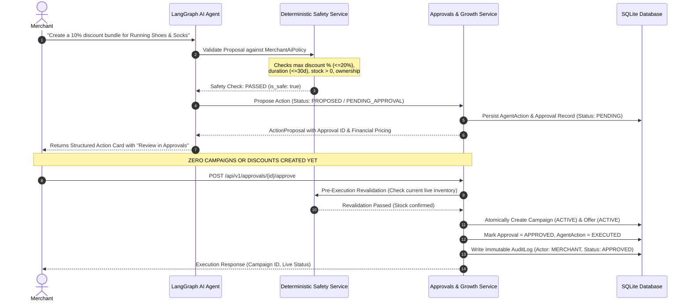

# AI Merchant Growth & Agentic Commerce Platform

<div align="center">


-brightgreen?style=for-the-badge&logo=pytest&logoColor=white)


<p align="center">
  <b>An Enterprise-Grade, Autonomous AI Commerce & Growth Optimization Platform.</b><br>
  Combines deterministic transactional commerce, LangGraph-driven revenue intelligence, resilient multi-LLM failover (Gemini ↔ Groq), and strict Human-In-The-Loop (HITL) safety governance.
</p>

</div>

---

## 📑 Table of Contents

- [1. Executive Summary](#1-executive-summary)
- [2. Platform Architecture](#2-platform-architecture)
  - [High-Level System Flow](#high-level-system-flow)
  - [Human-In-The-Loop (HITL) Governance Pipeline](#human-in-the-loop-hitl-governance-pipeline)
  - [LangGraph Agentic Decision StateGraph](#langgraph-agentic-decision-stategraph)
- [3. Evolution & Core Capabilities](#3-evolution--core-capabilities)
  - [Phase 1: Commerce Foundation & Transactional Integrity](#phase-1-commerce-foundation--transactional-integrity)
  - [Phase 2: Agentic Intelligence & Explainable AI](#phase-2-agentic-intelligence--explainable-ai)
  - [Phase 3: Autonomous Revenue Growth & Safety Boundaries](#phase-3-autonomous-revenue-growth--safety-boundaries)
- [4. Safety Invariants & Governance Rules](#4-safety-invariants--governance-rules)
- [5. Technology Stack](#5-technology-stack)
- [6. Repository Structure](#6-repository-structure)
- [7. Quick Start & Setup Guide](#7-quick-start--setup-guide)
  - [Prerequisites](#prerequisites)
  - [Backend Setup](#1-backend-setup)
  - [Frontend Setup](#2-frontend-setup)
  - [Docker Compose Deployment](#3-docker-compose-deployment)
- [8. Dual LLM Failover & Zero-Crash Mock Engine](#8-dual-llm-failover--zero-crash-mock-engine)
- [9. API Reference & Endpoints](#9-api-reference--endpoints)
- [10. Testing & Verification Suite](#10-testing--verification-suite)
- [11. Interactive User Experience](#11-interactive-user-experience)

---

## 1. Executive Summary

The **AI Merchant Growth & Agentic Commerce Platform** empowers merchants to scale gross merchandise value (GMV), increase Average Order Value (AOV), and liquidate slow-moving inventory through autonomous AI agent intelligence—while ensuring **absolute financial safety and zero unauthorized mutations**.

### Key Differentiators:
1. **Fact vs. Hypothesis Separation**: Every recommendation clearly separates verifiable database order statistics (**FACT**) from growth hypotheses (**AI INTERPRETATION**).
2. **Server-Side Deterministic Financial Pricing**: The backend strictly calculates bundle discounts, price subtotals, and margins on the server, rejecting untrusted client pricing.
3. **Dual LLM Provider Failover**: Primary LLM (Google Gemini) $\leftrightarrow$ Secondary LLM (Groq Llama 3.3 70B) $\leftrightarrow$ Local Deterministic Fallback Engine.
4. **Human-In-The-Loop (HITL) Guardrails**: AI Agent proposals remain non-executable drafts in a pending queue until verified and approved by the merchant.
5. **Idempotency & Pre-Execution Revalidation**: Guarantees zero duplicate campaign creation on double-clicks and automatically cancels approvals if real-time inventory depletes before approval.
6. **Immutable Audit Ledger**: Comprehensive chronological event sourcing tracking all actions by `AI_AGENT`, `MERCHANT`, and `SYSTEM`.

---

## 2. Platform Architecture

### High-Level System Flow



### Human-In-The-Loop (HITL) Governance Pipeline



### LangGraph Agentic Decision StateGraph

```mermaid
flowchart LR
    Start([Start]) --> N1[1. Load Merchant Context]
    N1 --> N2[2. Analyze Sales & Velocity]
    N2 --> N3[3. Analyze Products & Categories]
    N3 --> N4[4. Generate Revenue Opportunities]
    N4 --> N5[5. Validate Ground-Truth DB Rules]
    N5 --> N6[6. Explainable Synthesis & Proposal Formatting]
    N6 --> LLM[LLM Manager Failover]
    LLM --> End([Return Validated Opportunities & Proposals])
```



---

## 3. Evolution & Core Capabilities

### Phase 1: Commerce Foundation & Transactional Integrity
* **Multi-Tenant Relational Schema**: Clean SQLAlchemy 2.0 ORM models for `Merchant`, `Product`, `Customer`, `Order`, and `OrderItem`.
* **Server-Side Pricing Engine**: Client submissions provide product IDs and quantities; unit prices and totals are dynamically calculated on the backend from active inventory, strictly preventing client-side price tampering.
* **Transactional Safety**: Strict SQLite WAL mode with connection-level foreign key enforcement (`PRAGMA foreign_keys=ON;`).
* **Catalog & Order Management**: Full CRUD capabilities, stock validation, keyword search, status filtering, and low-inventory alerting.

### Phase 2: Agentic Intelligence & Explainable AI
* **LangGraph Multi-Node State Machine**: Ingests merchant context, computes co-purchasing affinity pairs, calculates product velocity, generates opportunities, and verifies against DB ground truth.
* **Standard of Explainability**: Differentiates empirical business evidence (**FACT**: "Running Shoes and Compression Socks co-purchased in 65% of orders") from hypothesis (**AI INTERPRETATION**: "Bundle offering a 10% discount is projected to raise AOV by ₹200").
* **Multi-LLM Failover**: Gemini $\leftrightarrow$ Groq $\leftrightarrow$ Deterministic Local Fallback engine.
* **Opportunity Taxonomy**:
  - `CROSS_SELL`: High affinity item pairs.
  - `UPSELL`: Premium tier recommendations within matching categories.
  - `BUNDLE`: Multi-item package combos to lift Average Order Value.
  - `SLOW_MOVING_PRODUCT`: Identifies capital trapped in dead stock and drafts liquidation promotions.

### Phase 3: Autonomous Revenue Growth & Safety Boundaries
* **Autonomous Action Proposals (`ActionProposal`)**: Natural language chat or analytical insights automatically emit structured, machine-readable proposal objects.
* **Deterministic Pricing Math**: Pre-computes `original_bundle_price`, `discounted_bundle_price`, discount amounts, and margin boundaries.
* **Configurable Merchant Safety Policies (`MerchantAiPolicy`)**:
  - Maximum discount percentage cap (default 20%).
  - Maximum absolute discount amount (e.g. ₹1,000 max).
  - Maximum campaign duration ceiling (e.g. 30 days max).
  - Cross-merchant ownership containment.
  - Inactive product & zero-inventory rejection.
* **Human-In-The-Loop (HITL) Workflow**: All financial mutations require explicit merchant approval via `/approvals`.
* **Pre-Execution Revalidation**: Protects against race conditions (e.g., product going out of stock while pending in the approval queue).
* **Strict Idempotency**: Repeated approval requests return the existing campaign without duplicating state.
* **Fault Injection & Resilience**: Dedicated simulation endpoints verify graceful failure handling and complete audit tracking.

---

## 4. Safety Invariants & Governance Rules

| Invariant | Rule | Enforcement Mechanism |
| :--- | :--- | :--- |
| **Zero Unauthorized Mutations** | The AI agent can NEVER directly activate campaigns, modify product prices, charge payments, or mutate inventory. | Strict read-only agent tools & HITL Approval gate. |
| **Server-Side Pricing** | Prices and discount calculations are NEVER trusted from client payloads. | Backend calculations querying verified product catalog records. |
| **Discount Policy Capping** | Discounts exceeding merchant policy limits are instantly blocked. | `SafetyService.validate_action_proposal()` raises HTTP 400 with granular violation reasons. |
| **Inventory Integrity** | Promotions cannot be scheduled or approved for out-of-stock items. | Checked at proposal time and re-validated at approval execution. |
| **Merchant Isolation** | Merchants cannot include products belonging to foreign merchants. | Foreign key constraint + multi-tenant merchant ID validation. |
| **Idempotent Operations** | Rapid or duplicate approval clicks cannot spawn duplicate campaigns. | Approval status check & existing campaign lookup. |
| **Full Auditability** | Every proposal, approval, rejection, and simulated failure must be logged. | Synchronous writes to `AuditLog` and `AgentAction` tables. |

---

## 5. Technology Stack

### Backend
* **Language & Runtime**: Python 3.12+
* **Web Framework**: FastAPI (Asynchronous REST API, auto-generated OpenAPI / Swagger docs)
* **Agentic Framework**: LangGraph (StateGraph multi-node state machine) & LangChain Core
* **LLM Integrations**: Google Gemini (`langchain-google-genai`), Groq Llama 3.3 (`langchain-groq`)
* **ORM & Database**: SQLAlchemy 2.0 with SQLite (WAL mode, explicit Foreign Key pragmas)
* **Data Validation & Settings**: Pydantic v2 & Pydantic-Settings
* **Testing**: Pytest & HTTPX TestClient (**60 unit & integration tests, 100% passing**)

### Frontend
* **UI Framework**: React 18 + TypeScript
* **Build Tool & Dev Server**: Vite 5.0
* **Routing**: React Router DOM v6
* **Iconography**: Lucide React
* **Styling**: Vanilla CSS Design System with dark glassmorphism, responsive data grids, modern typography (Inter/Outfit), and subtle micro-animations

---

## 6. Repository Structure

```text
selleragent/
├── backend/
│   ├── app/
│   │   ├── agent/                      # Phase 2 & 3 LangGraph Intelligence
│   │   │   ├── __init__.py
│   │   │   ├── graph.py                # Compiled LangGraph runnable workflow
│   │   │   ├── llm.py                  # Gemini <-> Groq failover & mock engine
│   │   │   ├── nodes.py                # State graph pipeline nodes
│   │   │   ├── prompts.py              # System prompts & explainability templates
│   │   │   ├── schemas.py              # Opportunity & Chat response schemas
│   │   │   ├── state.py                # TypedDict AgentState definition
│   │   │   └── tools.py                # Read-only deterministic DB analytics tools
│   │   ├── core/
│   │   │   ├── __init__.py
│   │   │   └── config.py               # Pydantic BaseSettings with LLM config
│   │   ├── db/
│   │   │   ├── __init__.py
│   │   │   ├── database.py             # SQLAlchemy Engine, SessionLocal, FK pragma
│   │   │   ├── models.py               # Merchant, Product, Customer, Order, Campaign, Approval, Audit
│   │   │   └── seed.py                 # Demo seed generator (Chennai Sports Store)
│   │   ├── routers/
│   │   │   ├── __init__.py
│   │   │   ├── agent.py                # /api/v1/agent (/analyze, /chat, /metrics)
│   │   │   ├── approvals.py            # /api/v1/approvals (/approve, /reject, /simulate-failure)
│   │   │   ├── audit.py                # /api/v1/audit (/logs)
│   │   │   ├── campaigns.py            # /api/v1/campaigns
│   │   │   ├── customers.py            # /api/v1/customers
│   │   │   ├── growth.py               # /api/v1/growth (/actions/propose, /policies)
│   │   │   ├── merchants.py            # /api/v1/merchants
│   │   │   ├── offers.py               # /api/v1/offers
│   │   │   ├── orders.py               # /api/v1/orders
│   │   │   └── products.py             # /api/v1/products
│   │   ├── schemas/                    # Pydantic validation models
│   │   │   ├── approval.py
│   │   │   ├── audit.py
│   │   │   ├── campaign.py
│   │   │   ├── customer.py
│   │   │   ├── growth.py
│   │   │   ├── merchant.py
│   │   │   ├── offer.py
│   │   │   ├── order.py
│   │   │   └── product.py
│   │   ├── services/                   # Business logic & domain services
│   │   │   ├── audit_service.py        # Audit logging service
│   │   │   ├── customer_service.py
│   │   │   ├── growth_service.py       # Action proposals, bundle pricing, approval execution
│   │   │   ├── merchant_service.py
│   │   │   ├── order_service.py
│   │   │   ├── product_service.py
│   │   │   └── safety_service.py       # Deterministic policy validation
│   │   └── main.py                     # FastAPI application factory & lifespan DB setup
│   ├── tests/                          # 60 Automated Unit & Integration Tests
│   │   ├── conftest.py
│   │   ├── test_agent_graph.py
│   │   ├── test_agent_llm.py
│   │   ├── test_agent_safety.py
│   │   ├── test_agent_state.py
│   │   ├── test_agent_tools.py
│   │   ├── test_customers.py
│   │   ├── test_health.py
│   │   ├── test_merchants.py
│   │   ├── test_orders.py
│   │   ├── test_phase3_agent_proposals.py
│   │   ├── test_phase3_approvals.py
│   │   ├── test_phase3_failure_handling.py
│   │   ├── test_phase3_growth.py
│   │   ├── test_phase3_idempotency.py
│   │   ├── test_phase3_safety.py
│   │   └── test_products.py
│   ├── seed.py
│   ├── verify_live.py                  # Live E2E smoke verification script
│   ├── requirements.txt
│   ├── .env.example
│   └── README.md
│
├── frontend/
│   ├── src/
│   │   ├── components/
│   │   │   ├── ActionProposalCard.tsx  # Structured AI proposal with financial breakdown
│   │   │   ├── ApprovalCard.tsx        # Financial review & one-click approve/reject
│   │   │   ├── Badge.tsx               # Status badges
│   │   │   ├── CustomerModal.tsx       # Customer creation modal
│   │   │   ├── Layout.tsx              # Navigation & merchant context switcher
│   │   │   ├── Modal.tsx               # Base modal component
│   │   │   ├── OpportunityCard.tsx     # Opportunity card with FACT vs AI INTERPRETATION
│   │   │   ├── OpportunityDetailsModal.tsx # Deep review modal
│   │   │   ├── OrderCreateModal.tsx    # Live order creation with price estimation
│   │   │   ├── OrderDetailsModal.tsx   # Order breakdown drawer
│   │   │   ├── ProductModal.tsx        # Add/edit product modal
│   │   │   └── StatCard.tsx            # KPI metric cards
│   │   ├── pages/
│   │   │   ├── AiAssistantPage.tsx     # Conversational assistant & opportunity viewer
│   │   │   ├── ApprovalsPage.tsx       # HITL Approvals Center
│   │   │   ├── AuditPage.tsx           # Activity & compliance audit logs
│   │   │   ├── CampaignsPage.tsx       # Active & draft marketing campaigns
│   │   │   ├── CustomersPage.tsx       # Customer records & spend tracking
│   │   │   ├── DashboardPage.tsx       # Executive revenue & growth KPIs
│   │   │   ├── OrdersPage.tsx          # Order ledger
│   │   │   └── ProductsPage.tsx        # Catalog & inventory management
│   │   ├── services/                   # Frontend API Clients
│   │   │   ├── agentService.ts
│   │   │   ├── approvalService.ts
│   │   │   ├── auditService.ts
│   │   │   ├── campaignService.ts
│   │   │   ├── customerService.ts
│   │   │   ├── growthService.ts
│   │   │   ├── merchantService.ts
│   │   │   ├── orderService.ts
│   │   │   └── productService.ts
│   │   ├── types/
│   │   │   └── index.ts                # TypeScript domain models & interfaces
│   │   ├── App.tsx                     # Route configuration
│   │   ├── index.css                   # Glassmorphic design system tokens
│   │   └── main.tsx
│   ├── package.json
│   ├── tsconfig.json
│   ├── vite.config.ts
│   └── README.md
├── docker-compose.yml
├── .gitignore
└── README.md
```

---

## 7. Quick Start & Setup Guide

### Prerequisites
* **Python 3.12+**
* **Node.js 18+ & npm**
* (Optional) **Docker & Docker Compose**

---

### 1. Backend Setup

```bash
cd backend

# 1. Create and activate a virtual environment
python -m venv venv
.\venv\Scripts\Activate.ps1   # Windows PowerShell
# source venv/bin/activate     # Linux / macOS

# 2. Install all dependencies
pip install -r requirements.txt

# 3. Configure environment variables
cp .env.example .env

# 4. Seed database with demo merchant 'Chennai Sports Store'
python seed.py

# 5. Run the automated test suite (60 tests)
pytest -v

# 6. Start the FastAPI development server
uvicorn app.main:app --reload --port 8000
```

* **API Health**: [http://127.0.0.1:8000/api/v1/health](http://127.0.0.1:8000/api/v1/health)
* **Interactive Swagger UI**: [http://127.0.0.1:8000/docs](http://127.0.0.1:8000/docs)
* **ReDoc Documentation**: [http://127.0.0.1:8000/redoc](http://127.0.0.1:8000/redoc)

---

### 2. Frontend Setup

```bash
cd frontend

# 1. Install npm packages
npm install

# 2. Start Vite development server
npm run dev
```

* **Merchant Dashboard**: [http://localhost:5173/dashboard](http://localhost:5173/dashboard)
* **AI Merchant Assistant**: [http://localhost:5173/ai-assistant](http://localhost:5173/ai-assistant)
* **Approvals Center**: [http://localhost:5173/approvals](http://localhost:5173/approvals)
* **Campaigns Manager**: [http://localhost:5173/campaigns](http://localhost:5173/campaigns)
* **Audit Trail**: [http://localhost:5173/audit](http://localhost:5173/audit)

---

### 3. Docker Compose Deployment

To spin up the entire full-stack platform in isolated containers:

```bash
docker-compose up --build
```

---

## 8. Dual LLM Failover & Zero-Crash Mock Engine

Configure your LLM settings in `backend/.env`:

```ini
# Primary Provider Choice: "gemini" or "groq"
PRIMARY_LLM_PROVIDER=gemini

# Google Gemini Configuration
GEMINI_API_KEY="your_google_gemini_api_key"
GEMINI_MODEL=gemini-2.5-flash

# Groq Configuration
GROQ_API_KEY="your_groq_api_key"
GROQ_MODEL=llama-3.3-70b-versatile

# Fallback Mode
MOCK_AI_MODE=false
```

### Failover Resilience Matrix:
1. **Primary LLM**: The system queries `PRIMARY_LLM_PROVIDER` first.
2. **Automatic Secondary Failover**: If the primary provider triggers rate limits, connection timeouts, or HTTP errors, the system automatically routes the request to the secondary provider without user disruption.
3. **Local Mock Fallback**: If no API keys are provided or all cloud providers fail, the platform gracefully switches to the internal **Deterministic Rule-Based Analytics Engine**, calculating accurate insights directly from the local database with **zero crashes**.

---

## 9. API Reference & Endpoints

| Method | Endpoint | Description |
| :--- | :--- | :--- |
| `GET` | `/api/v1/health` | Service health status and database connectivity check. |
| `POST` | `/api/v1/agent/analyze` | Executes LangGraph state machine to extract validated growth opportunities. |
| `POST` | `/api/v1/agent/chat` | Conversational interface returning insights and structured action proposals. |
| `GET` | `/api/v1/agent/metrics/{merchant_id}` | Aggregated metrics on active opportunities and projected revenue impact. |
| `POST` | `/api/v1/growth/actions/propose` | Validates and registers a new growth action proposal. |
| `GET` | `/api/v1/growth/policies/{merchant_id}` | Retrieves active merchant AI safety policy limits. |
| `PUT` | `/api/v1/growth/policies/{merchant_id}` | Updates safety limits (max discount %, max duration, etc.). |
| `GET` | `/api/v1/approvals` | Lists pending, approved, or rejected merchant approval requests. |
| `GET` | `/api/v1/approvals/{id}` | Retrieves full proposal details, pricing math, and safety check results. |
| `POST` | `/api/v1/approvals/{id}/approve` | **Merchant Approval**: Re-validates inventory and launches live campaign/offers. |
| `POST` | `/api/v1/approvals/{id}/reject` | **Merchant Rejection**: Marks proposal rejected with audit reasoning. |
| `POST` | `/api/v1/approvals/{id}/simulate-failure` | Fault testing: Triggers controlled failure to verify audit rollback. |
| `GET` | `/api/v1/campaigns` | Lists active, draft, paused, or completed marketing campaigns. |
| `GET` | `/api/v1/offers` | Lists discount offers linked to campaigns and catalog items. |
| `GET` | `/api/v1/audit/logs` | Immutable activity ledger filtered by merchant, actor, and status. |
| `GET` / `POST` | `/api/v1/products` | Catalog management, stock tracking, and keyword filtering. |
| `GET` / `POST` | `/api/v1/orders` | Order placement with backend pricing engine & stock deductions. |
| `GET` / `POST` | `/api/v1/customers` | Customer directory and lifetime spending ledger. |

---

## 10. Testing & Verification Suite

### Automated Pytest Suite (60 Tests)

The backend features 60 automated unit, integration, and safety tests:

```bash
cd backend
.\venv\Scripts\python.exe -m pytest -v
```

```text
============================= test session starts =============================
platform win32 -- Python 3.12.4, pytest-8.4.2
collected 60 items

tests\test_agent_graph.py .....                                          [  8%]
tests\test_agent_llm.py ....                                             [ 15%]
tests\test_agent_safety.py ..                                            [ 18%]
tests\test_agent_state.py ..                                             [ 21%]
tests\test_agent_tools.py ......                                         [ 31%]
tests\test_customers.py ....                                             [ 38%]
tests\test_health.py .                                                   [ 40%]
tests\test_merchants.py .......                                          [ 51%]
tests\test_orders.py .....                                               [ 60%]
tests\test_phase3_agent_proposals.py ..                                  [ 63%]
tests\test_phase3_approvals.py ...                                       [ 68%]
tests\test_phase3_failure_handling.py .                                  [ 70%]
tests\test_phase3_growth.py ....                                         [ 76%]
tests\test_phase3_idempotency.py .                                       [ 78%]
tests\test_phase3_safety.py .......                                      [ 90%]
tests\test_products.py ......                                            [100%]

============================== 60 passed in 1.27s ==============================
```

### Live Smoke & Failover Verification

Run the end-to-end smoke verification script against a running server:

```bash
cd backend
python verify_live.py
```

---

## 11. Interactive User Experience

The frontend is crafted with a modern dark glassmorphic design system:

* **Executive Dashboard (`/dashboard`)**: Displays real-time KPIs (Total Revenue, Orders, Catalog Size, Active AI Opportunities, Pending Approvals, Active Campaigns, and Low Stock Alerts).
* **AI Merchant Assistant (`/ai-assistant`)**: Interactive chat interface with quick action chips, opportunity cards (with explicit FACT vs. HYPOTHESIS separation), and inline Action Proposal cards linking directly to merchant review.
* **Action Approvals Center (`/approvals`)**: Merchant review queue displaying proposed discounts, duration, financial pricing breakdown (Original vs. Discounted), and One-Click Approve / Reject buttons with reason input.
* **Campaign Manager (`/campaigns`)**: Central overview of all active, draft, and completed campaigns with linked offers and product role assignments.
* **Audit Trail (`/audit`)**: Real-time compliance ledger with actor badges (`AI_AGENT`, `MERCHANT`, `SYSTEM`), timestamps, and structured JSON metadata inspection.
* **Catalog & Orders Management (`/products`, `/orders`, `/customers`)**: Interactive modals, live price estimation, and stock tracking.

---

<div align="center">
  <b>AI Merchant Growth & Agentic Commerce Platform</b><br>
  Engineered for Revenue Scalability, Explainability, and Uncompromising Financial Safety.
</div>
